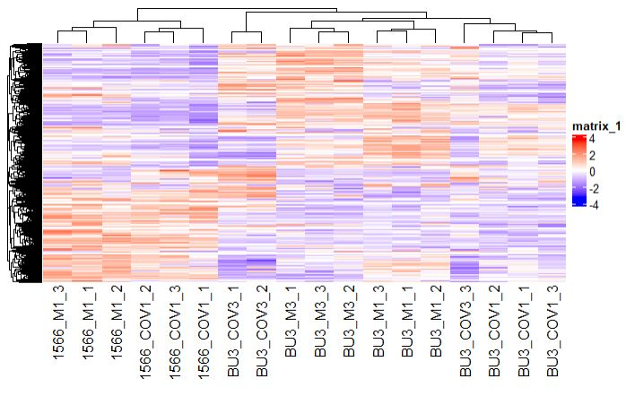
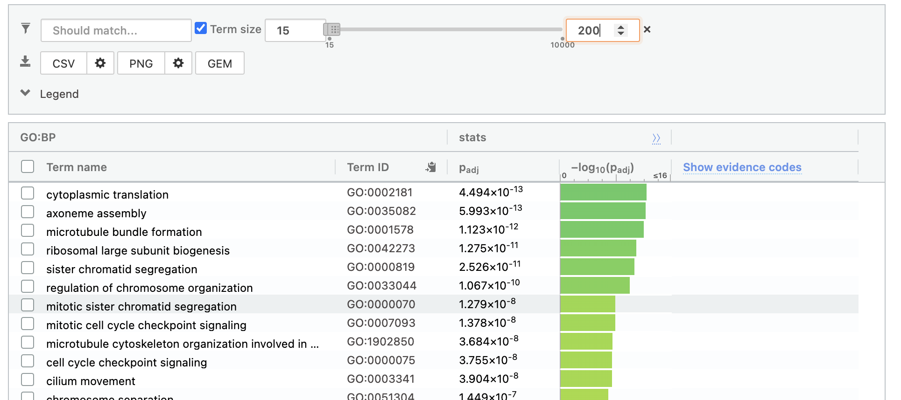
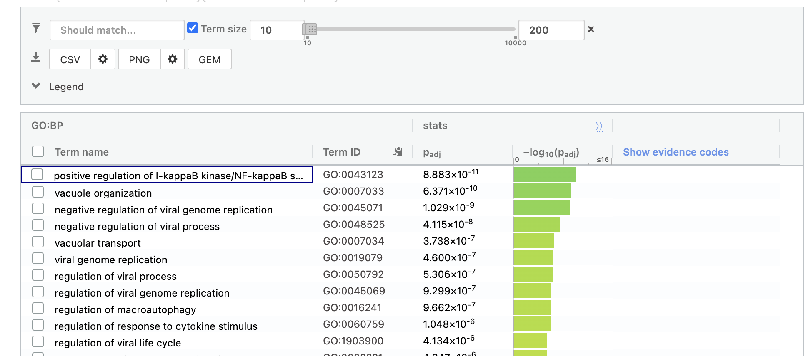

### Downloading the Packages/Data
Downloading any packages that I will need to work
on the data set, and load it into the library.
```{r}
# Installing packages if they are not installed
if (!requireNamespace("BiocManager", quietly = TRUE))
  install.packages("BiocManager", repos='http://cran.us.r-project.org')

if (!requireNamespace("GEOmetadb", quietly = TRUE))
  BiocManager::install("GEOmetadb")

if (!requireNamespace("edgeR", quietly = TRUE))
  BiocManager::install("edgeR")

if (!requireNamespace("biomaRt", quietly = TRUE))
  install.packages("biomaRt")

if (!requireNamespace("knitr", quietly = TRUE))
  install.packages("knitr")

if (!requireNamespace("ComplexHeatmap", quietly = TRUE))
    BiocManager::install("ComplexHeatmap")

if (!requireNamespace("circlize", quietly = TRUE))
    BiocManager::install("circlize")

# Importing packages
library(circlize)
suppressPackageStartupMessages(library(ComplexHeatmap))
library(BiocManager)
library(GEOmetadb)
library(edgeR)
library(knitr)
library(biomaRt)
```

### Getting Data
Retrieve the normalized data from the txt file, this is the data
from A1.
```{r}
n_data <- read.table("cleaned_data.txt", sep = " ", dec = ".")
```


### Samples
Renaming column names for the samples.
```{r}
# Rename sample names
colnames(n_data)[3:20] <- c("BU3_M1_1", "BU3_M1_2", "BU3_M1_3", "BU3_COV1_1", "BU3_COV1_2", "BU3_COV1_3", 
                            "BU3_M3_1", "BU3_M3_2", "BU3_M3_3", "BU3_COV3_1", "BU3_COV3_2", "BU3_COV3_3",
                            "1566_M1_1", "1566_M1_2", "1566_M1_3", "1566_COV1_1", "1566_COV1_2", "1566_COV1_3")
# Define sample groups
samples <- data.frame(
        lapply(colnames(n_data)[3:20], 
        FUN=function(x){
          unlist(strsplit(x, split = "\\_"))[c(2,3)]}))
samples <- data.frame(t(samples))
rownames(samples) <- colnames(n_data)[3:20]
samples
```


# Model for sample
```{r}
model_design <- model.matrix(~ samples$X2 )
kable(model_design[1:5,], type="html")
```


```{r}
expressionMatrix <- as.matrix(n_data[3:20])
rownames(expressionMatrix) <- 
  n_data$ensembl_gene_id
colnames(expressionMatrix) <- 
  colnames(n_data)[3:20]
minimalSet <- ExpressionSet(assayData=expressionMatrix)
fit <- lmFit(minimalSet, model_design)
```

### Applying Bayes and getting p values
```{r}
fit2 <- eBayes(fit,trend=TRUE)
topfit <- topTable(fit2, 
                   coef=ncol(model_design),
                   adjust.method = "BH",
                   number = nrow(expressionMatrix))
#merge hgnc names to topfit table
output_hits <- merge(n_data[,1:2],
                     topfit,
                     by.y=0,by.x=1,
                     all.y=TRUE)
#sort by pvalue
output_hits <- output_hits[order(output_hits$P.Value),]
kable(output_hits[1:10,3:8],type="html",row.names = FALSE)
length(which(output_hits$P.Value < 0.6))
```

I used the BH method. I used this method as it is the standard method.

** Number of genes pass p < 0.6:**: `r length(which(output_hits$P.Value < 0.6))` 

I used the threshold of 0.6 as it was the logical choice after seeing that
none of the values in my MDS in A1 surpassed 0.6.  

### MA Plot
```{r}
model_design_pat <- model.matrix(
  ~ samples$X1 + samples$X2)
kable(model_design_pat[1:5,1:5],type="html")

fit_pat <- lmFit(minimalSet, model_design_pat)

fit2_pat <- eBayes(fit_pat,trend=TRUE)
topfit_pat <- topTable(fit2_pat, 
                   coef=ncol(model_design_pat),
                   adjust.method = "BH",
                   number = nrow(expressionMatrix))
#merge hgnc names to topfit table
output_hits_pat <- merge(n_data[,1:2],
                         topfit_pat,by.y=0,by.x=1,all.y=TRUE)
#sort by pvalue
output_hits_pat <- output_hits_pat[order(output_hits_pat$P.Value),]
```

```{r}
simple_model_pvalues <- data.frame(ensembl_id =
  output_hits$ensembl_gene_id,
  simple_pvalue=output_hits$P.Value)
pat_model_pvalues <-  data.frame(ensembl_id =
  output_hits_pat$ensembl_gene_id,
  patient_pvalue = output_hits_pat$P.Value)
#two_models_pvalues <- merge(simple_model_pvalues,
#  pat_model_pvalues,by.x=1,by.y=1)
# two_models_pvalues$colour <- "black"
# two_models_pvalues$colour[
#   two_models_pvalues$simple_pvalue<0.05] <- "orange"
# two_models_pvalues$colour[
#   two_models_pvalues$patient_pvalue<0.05] <- "blue"
# two_models_pvalues$colour[
#   two_models_pvalues$simple_pvalue<0.05 &
#   two_models_pvalues$patient_pvalue<0.05] <- "red"
# plot(two_models_pvalues$simple_pvalue,
#      two_models_pvalues$patient_pvalue,
#      col = two_models_pvalues$colour,
#      xlab = "simple model p-values",
#      ylab ="Patient model p-values", 
#      main="Simple vs Patient Limma")
```
For some reason, my computer runs out of memory running the plot, so I excluded it.


### Volcano plot
Building volcano plot
```{r, message = FALSE, warning=FALSE, fig.cap="Volcano plot"}
# Assign colours to genes: up-regulated is red, down-regulated is blue
colours <- vector(mode="character", length=nrow(output_hits))
colours[] <- 'grey'
colours[output_hits$logFC < 0 & output_hits$P.Value < 0.6] <- 'blue'
colours[output_hits$logFC > 0 & output_hits$P.Value < 0.6] <- 'red'
# Make plot
plot(output_hits$logFC,
     -log(output_hits$P.Value, base=10),
     col = colours,
     xlab = "logFC",
     ylab ="-log(p-value)", 
     main="Volcano Plot")
# Create legend
legend(2.5, 5, legend=c("down-regulated genes","up-regulated genes", "non-significant"),
       fill = c("blue", "red", "grey"), cex = 0.6)
```


### Creating a heatmap
```{r}
heatmap_matrix <- n_data[,3:ncol(n_data)]
rownames(heatmap_matrix) <- n_data$ensembl_gene_id
colnames(heatmap_matrix) <- colnames(n_data[,
                        3:ncol(n_data)])

heatmap_matrix <- t(scale(t(heatmap_matrix)))
if(min(heatmap_matrix) == 0){
    heatmap_col = colorRamp2(c( 0, max(heatmap_matrix)), 
                      c( "white", "red"))
  } else {
    heatmap_col = colorRamp2(c(min(heatmap_matrix), 0,
        max(heatmap_matrix)), c("blue", "white", "red"))
  }
current_heatmap <- Heatmap(as.matrix(heatmap_matrix),
      show_row_dend = TRUE,show_column_dend = TRUE, 
      col=heatmap_col,show_column_names = TRUE, 
      show_row_names = FALSE,show_heatmap_legend = TRUE)
#current_heatmap
```



It seems there is clustering in the first 3 tested. This could be due to are 
more of the "control" in the experiment. 

# Thresholded over-representation analysis

### Creating thresholded list of genes
Made  a list for up and down regulated genes
```{r, message = FALSE, warning=FALSE}
# Create separate tables of up- and down-regulated genes
upreg_genes <- output_hits_pat[output_hits_pat$P.Value < 0.6 & output_hits_pat$logFC > 0,]
downreg_genes <- output_hits_pat[output_hits_pat$P.Value < 0.6 & output_hits_pat$logFC < 0,]

# get the hgnc symbols for profiling
mart <- useDataset("hsapiens_gene_ensembl", useMart("ensembl"))
genes <- upreg_genes$hgnc_symbol
up_G_list <- getBM(filters= "ensembl_gene_id", attributes= c("ensembl_gene_id",
"hgnc_symbol"),values=genes,mart= mart)

genes <- downreg_genes$hgnc_symbol
down_G_list <- getBM(filters= "ensembl_gene_id", attributes= c("ensembl_gene_id",
"hgnc_symbol"),values=genes,mart= mart)

# Write tables to files
write.table(x=up_G_list$hgnc_symbol,
            "./upreg_genes.txt",sep='\t',
            row.names = FALSE,col.names = FALSE,quote = FALSE)
write.table(x=down_G_list$hgnc_symbol,
            "./downreg_genes.txt",sep='\t',
            row.names = FALSE,col.names = FALSE,quote = FALSE)

```


### G:Profiler analysis on thresholded gene lists

I used G:Profiler. After using it in class and for one of the journal entries, it was good to analyze a gene list.  

I used data from Reactome, Go bp, and Wikipathways.

I especially used Go Bp since it had the most data and complete set of biological processes.  

**Results using the up-regulated genes:**  



* There are 106 from GO:BP, 50 from Reactome, and 5 from WikiPathways  

**Results using the down-regulated genes:**  



* Limiting term size to 200, there are 75 from GO:BP, 22 from Reactome, and 16 from WikiPathways.
  
### Interpretation

* Do the over-representation results support conclusions or mechanism discussed in the original paper?

Yes it does, many of the results from GO:BP include viral systems and processes.

* Can you find evidence, i.e. publications, to support some of the results that you see. How does this evidence support your results.

In an article by V'kovski et al. the COVID virus initiation creates host immune evasion and provides cofactors for replication. This justifies the my findings where the there is negative regulation of the viral replication, in order for the lungs and alveolar cells to defend themselves. 

## References
Huang, J., Hume, A. J., Abo, K. M., Werder, R. B., Villacorta-Martin, C., Alysandratos, K.-D., Beermann, M. L., Simone-Roach, C., Lindstrom-Vautrin, J., Olejnik, J., Suder, E. L., Bullitt, E., Hinds, A., Sharma, A., Bosmann, M., Wang, R., Hawkins, F., Burks, E. J., Saeed, M., … Kotton, D. N. (2020, August 6). SARS-COV-2 infection of pluripotent stem cell-derived human lung alveolar type 2 cells elicits a rapid epithelial-intrinsic inflammatory response. bioRxiv : the preprint server for biology. Retrieved February 21, 2022, from https://www.ncbi.nlm.nih.gov/pmc/articles/PMC7337394.1/ 

Robinson MD, McCarthy DJ and Smyth GK , 2010. edgeR: a Bioconductor package for differential expression analysis of digital gene expression data.
  Bioinformatics 26, 139-140
  
V’kovski, P., Kratzel, A., Steiner, S., Stalder, H., &amp; Thiel, V. (2020, October 28). Coronavirus Biology and replication: Implications for SARS-COV-2. Nature News. Retrieved March 15, 2022, from https://www.nature.com/articles/s41579-020-00468-6   
  
Wang X, Cairns MJ (2013). “Gene Set Enrichment Analysis of RNA-Seq Data: Integrating Differential Expression and Splicing.” BMC Bioinformatics, 14(Suppl 5), S16.

Huang, J., Hume, A. J., Abo, K. M., Werder, R. B., Villacorta-Martin, C., Alysandratos, K.-D., Beermann, M. L., Simone-Roach, C., Lindstrom-Vautrin, J., Olejnik, J., Suder, E. L., Bullitt, E., Hinds, A., Sharma, A., Bosmann, M., Wang, R., Hawkins, F., Burks, E. J., Saeed, M., … Kotton, D. N. (2020, August 6). SARS-COV-2 infection of pluripotent stem cell-derived human lung alveolar type 2 cells elicits a rapid epithelial-intrinsic inflammatory response. bioRxiv : the preprint server for biology. Retrieved March 15, 2022, from https://www.ncbi.nlm.nih.gov/pmc/articles/PMC7337394/ 

Wang X, Cairns MJ (2014). “SeqGSEA: a Bioconductor package for gene set enrichment analysis of RNA-Seq data integrating differential expression and splicing.” Bioinformatics, 30(12), 1777-9.

Davis, S. and Meltzer, P. S, 2007, GEOquery: a bridge between the Gene Expression Omnibus (GEO) and BioConductor. Bioinformatics, 14, 1846-1847

Steffen Durinck, Paul T. Spellman, Ewan Birney and
  Wolfgang Huber. 2009 Mapping identifiers for the integration of genomic datasets with the R/Bioconductor package biomaRt. , Nature Protocols 4, 1184-1191.

Xie Y (2014). “knitr: A Comprehensive Tool for Reproducible Research in R.” In Stodden V, Leisch F, Peng RD (eds.), Implementing Reproducible Computational Research. Chapman and Hall/CRC. ISBN 978-1466561595, http://www.crcpress.com/product/isbn/9781466561595.

Zhu Y, Davis S, Stephens R, Meltzer PS, Chen Y (2008). “GEOmetadb: powerful alternative search engine for the Gene Expression Omnibus.” Bioinformatics (Oxford, England), 24(23), 2798–2800. ISSN 1367-4811, doi: 10.1093/bioinformatics/btn520, http://www.ncbi.nlm.nih.gov/pubmed/18842599.


