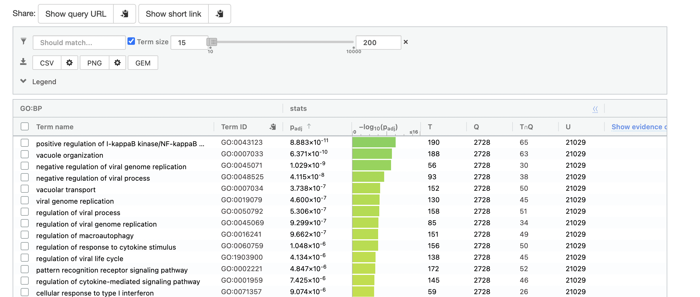
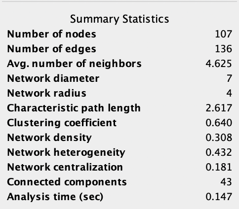
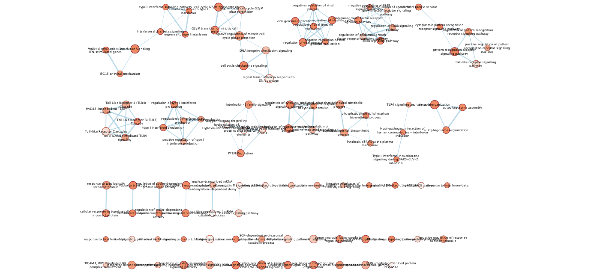
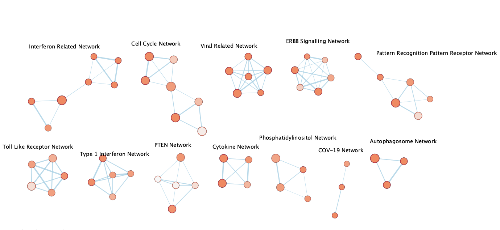
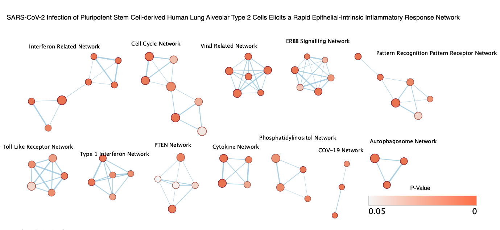
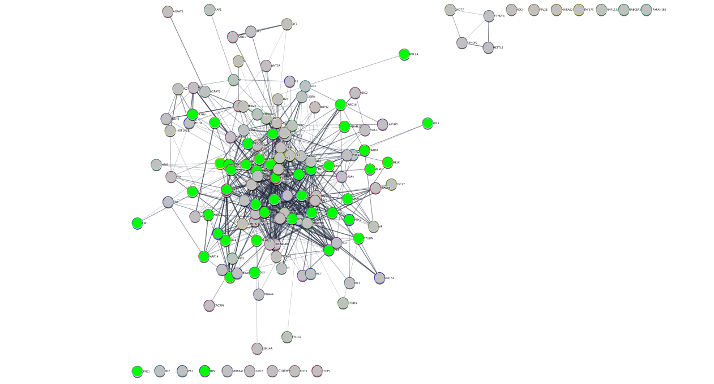

## Intro

I used the data from an experiment SARS-CoV-2 Infection of Pluripotent Stem Cell-derived Human Lung Alveolar Type 2 Cells Elicits a Rapid Epithelial-Intrinsic Inflammatory Response.

Previously, I was able to retrieve data from the experiment, clean out the data, filter out
low counts, normalize the data, and interpret the the data with different plots.

Then I was able to do differential gene expression for my data set by calculating p-values and
visualized it using a volcano plot and a heatmap.

I then used the gene list obtained and used G: Profiler to run a thresholded gene set enrichment analysis.

In this journal, I will be trying to use GSEA for a non thresholded gene set and visualize it 
using Cytoscape.


## Installing
```{r}
#install required R and bioconductor packages
tryCatch(expr = { library("RCurl")}, 
         error = function(e) {  install.packages("RCurl")}, 
         finally = library("RCurl"))
#make sure biocManager is installed
tryCatch(expr = { library("BiocManager")}, 
         error = function(e) { 
           install.packages("BiocManager")}, 
         finally = library("BiocManager"))
tryCatch(expr = { library("ggplot2")}, 
         error = function(e) { install.packages("ggplot2")}, 
         finally = library("ggplot2"))
#use easy cyRest library to communicate with cytoscape.
tryCatch(expr = { library("RCy3")}, 
         error = function(e) { BiocManager::install("RCy3")}, 
         finally = library("RCy3"))
```

```{r}
gmt_url = "http://download.baderlab.org/EM_Genesets/current_release/Human/symbol/"
# list all the files on the server
filenames = getURL(gmt_url)
tc = textConnection(filenames)
contents = readLines(tc)
close(tc)
# get the gmt that has all the pathways and does not include terms inferred
# from electronic annotations(IEA) start with gmt file that has pathways only
rx = gregexpr("(?<=<a href=\")(.*.GOBP_AllPathways_no_GO_iea.*.)(.gmt)(?=\">)", contents,
    perl = TRUE)
gmt_file = unlist(regmatches(contents, rx))
dest_gmt_file <- file.path("~/BCB/BCB420/Jeffrey_Chen", gmt_file)
download.file(paste(gmt_url, gmt_file, sep = ""), destfile = dest_gmt_file)
```

### NOTE (GSEA was not working for me on my laptop so I adapted and used G:Profiler)

## Non-thresholded Gene set Analysis

From the previous assignment, I used the BH method. I used this method as it is the standard method.

In G:profiler, I used GO biological process, WP, and Reactome. 

**Results using the ranked genes list:**  



From these results, there are 73 from GO:BP, 19 from Reactome, and 15 from WikiPathways.  

Comparing these results from A2, the G:Profiler results are similar to the results for the 
down-regulated genes.

This is not a completely straight forward comparison, due to possible genes that may have been lost due to the fact that G:Profiler might not be able to find every gene from the ranked gene list.

## Visualizing Gene set Enrichment Analysis in Cytoscape

There are 107 nodes and 136 edges. The thresholds used to create this map were a P-value of 0.05 and edge cutoff of 0.375.

**Network Info:**  



**Network prior to manual layout:**  


In my annotated network, I group together the networks which all had more than 1 edge in the network. I then annotated and label the networks with the names of what they were connected by. 

**Annotated network:**  



**Publication ready theme network:**  



## Interpretation


1. Do the enrichment results support conclusions or mechanism discussed in the original paper? How do these results differ from the results you got from Assignment #2 thresholded methods?    
Yes the enrichment results support the conclusions and mechanisms discussed in the original paper. In the paper, they discuss many viral systems that were shown in the SEA and the network, as well as interferon, pattern recognition, as well as epithelial systems and responses.  

2. Can you find evidence, i.e. publications, to support some of the results that you see. How does this evidence support your result?  
In a paper by Kim and Shin, it further supports the results that we see. In this paper, they further demonstrate a link between interferons and the role it plays when the immune system responds to covid, such as cytokine production to receptor signalling. 

3. Choose a specific pathway or theme to investigate in more detail. Why did you choose this pathway or theme? Show the pathway or theme as a gene network or as a pathway diagram. Annotate the network or pathway with your original log fold expression values and p-values to show how it is effected in your model.  
I picked the regulation of cytokine-mediated signalling pathway. I chose this pathway as it seems that cytokine regulation might play a big role in viral responses in COVID19.

**Gene network:**  



## References
Huang, J., Hume, A. J., Abo, K. M., Werder, R. B., Villacorta-Martin, C., Alysandratos, K.-D., Beermann, M. L., Simone-Roach, C., Lindstrom-Vautrin, J., Olejnik, J., Suder, E. L., Bullitt, E., Hinds, A., Sharma, A., Bosmann, M., Wang, R., Hawkins, F., Burks, E. J., Saeed, M., … Kotton, D. N. (2020, August 6). SARS-COV-2 infection of pluripotent stem cell-derived human lung alveolar type 2 cells elicits a rapid epithelial-intrinsic inflammatory response. bioRxiv : the preprint server for biology. Retrieved February 21, 2022, from https://www.ncbi.nlm.nih.gov/pmc/articles/PMC7337394.1/ 

Robinson MD, McCarthy DJ and Smyth GK , 2010. edgeR: a Bioconductor package for differential expression analysis of digital gene expression data.
  Bioinformatics 26, 139-140
  
Duncan Temple Lang (2022). RCurl: General Network (HTTP/FTP/...) Client Interface for R. R
  package version 1.98-1.6. https://CRAN.R-project.org/package=RCurl

Huang, J., Hume, A. J., Abo, K. M., Werder, R. B., Villacorta-Martin, C., Alysandratos, K.-D., Beermann, M. L., Simone-Roach, C., Lindstrom-Vautrin, J., Olejnik, J., Suder, E. L., Bullitt, E., Hinds, A., Sharma, A., Bosmann, M., Wang, R., Hawkins, F., Burks, E. J., Saeed, M., … Kotton, D. N. (2020, August 6). SARS-COV-2 infection of pluripotent stem cell-derived human lung alveolar type 2 cells elicits a rapid epithelial-intrinsic inflammatory response. bioRxiv : the preprint server for biology. Retrieved March 15, 2022, from https://www.ncbi.nlm.nih.gov/pmc/articles/PMC7337394/ 

Steffen Durinck, Paul T. Spellman, Ewan Birney and
  Wolfgang Huber. 2009 Mapping identifiers for the integration of genomic datasets with the R/Bioconductor package biomaRt. , Nature Protocols 4, 1184-1191.
  
H. Wickham. ggplot2: Elegant Graphics for Data Analysis. Springer-Verlag New York, 2016.

Gustavsen JA, Pai S, Isserlin R et al. RCy3: Network biology using Cytoscape from within R
  [version 3; peer review: 3 approved]. F1000Research 2019, 8:1774
  (https://doi.org/10.12688/f1000research.20887.3)

Kim YM, Shin EC. Type I and III interferon responses in SARS-CoV-2 infection. Exp Mol Med. 2021 May;53(5):750-760. doi: 10.1038/s12276-021-00592-0. Epub 2021 May 6. PMID: 33953323; PMCID: PMC8099704.

